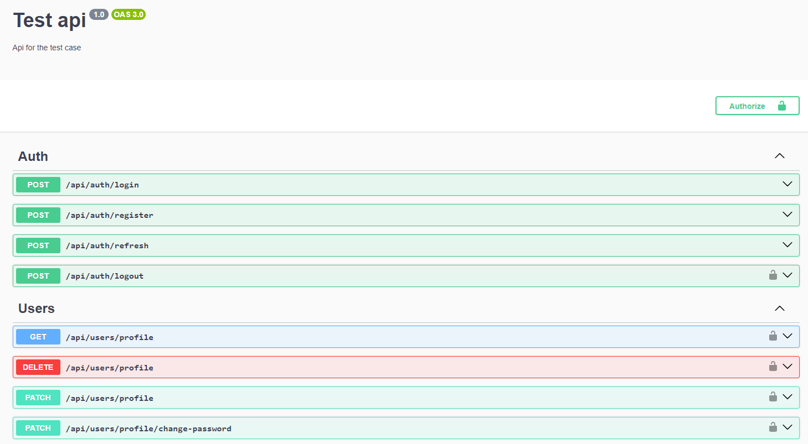

# Zentriflex Test Task

This repository was created for a test job for a Trainee/Junior Back-End Developer position.

## System Requirements Specification (SRS)

The project is an API for registration and login system as well as management of user's personal profile.

1. User must be able to register in the system using e-mail and password.
2. User must be able to log in using email and password.
3. JWT tokens must be used for authorization and authentication.
4. User must be able to refresh the access token using the refresh token.
5. User must be able to terminate the current session.
6. User should be able to delete their profile from the system.
7. User should be able to get information about their profile.
8. User must be able to change the password for their account.
9. User should be able to change the contact details of their profile.

## Technology Stack

The following technology stack was used in the project:

-   `Node.js, JavaScript, TypeScript, Nest.js` - Platform for system development.
-   `Prisma ORM, PostgreSQL` - To work with the database.
-   `Passport.js, argon2, crypto` - To implement authorization and authentication using JWT tokens.
-   `Swagger` - For the OpenAPi implementation.

## Docs

### OpenApi



OpenApi documentation has been added to the project. The documentation is implemented using Swagger. The path where the documentation is available is below.

```js
{{base_url}}/api
```

## Quick Start

### Installation

```shell
yarn install
```

### Config

Create an `.env` file in the root of the project and fill it with the required parameters.

```
# Port on which the application runs
# if no port is specified the application runs on port 5050
PORT=

# Database connection string
DATABASE_URL=

# Configuration of JWT Access and Refresh Token Settings.
# The parameters JWT_ACCESS_TOKEN_EXP and JWT_REFRESH_TOKEN_EXP
# take values in minutes
JWT_SECRET_KEY=
JWT_TOKEN_AUDIENCE=
JWT_TOKEN_ISSUER=
JWT_ACCESS_TOKEN_EXP=
JWT_REFRESH_TOKEN_EXP=
```

### Running the app

```shell
# development
yarn run start

# watch mode
yarn run start:dev

# production mode
yarn run start:prod
```
